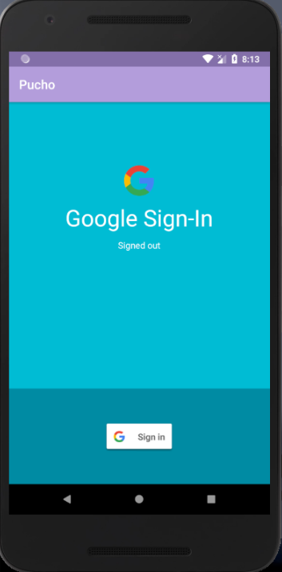
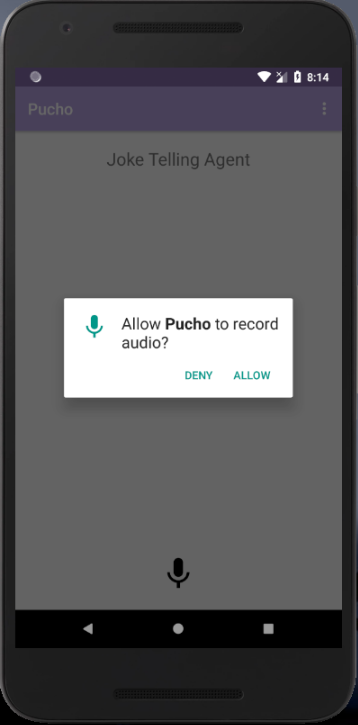
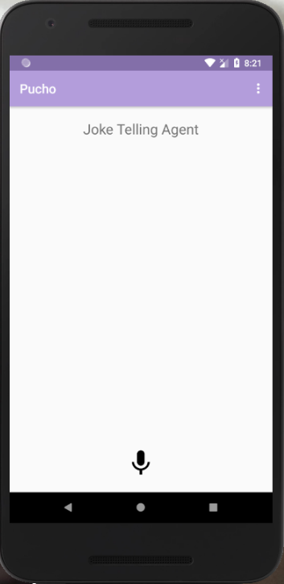
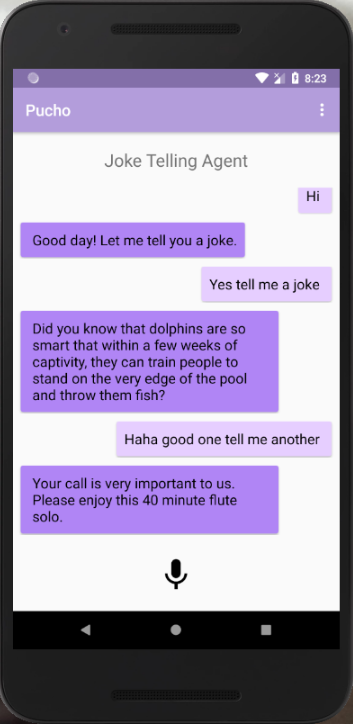
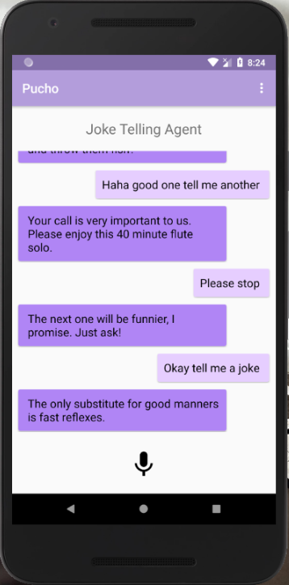
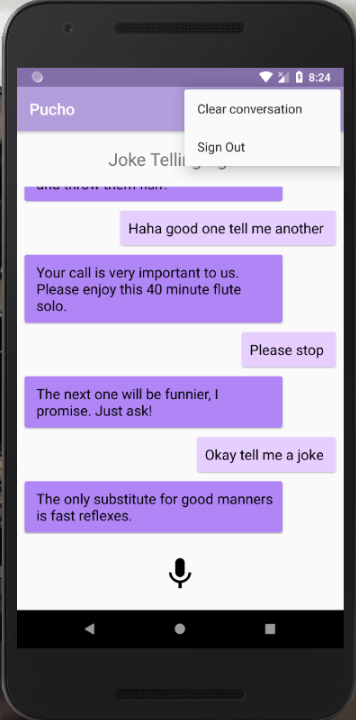

# Talking-Agent
Used DialogFlow API to allow users to talk to a virtual agent who tells jokes

Google Sign In Activity

Audio permission to listen to user using microphone

Hone Screen - Displays the conversation with the agent

Options menu

